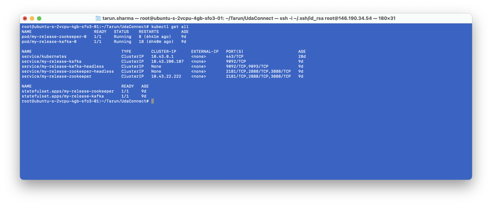
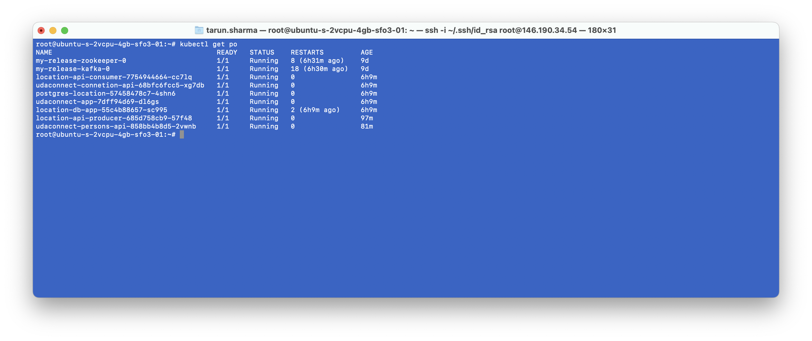
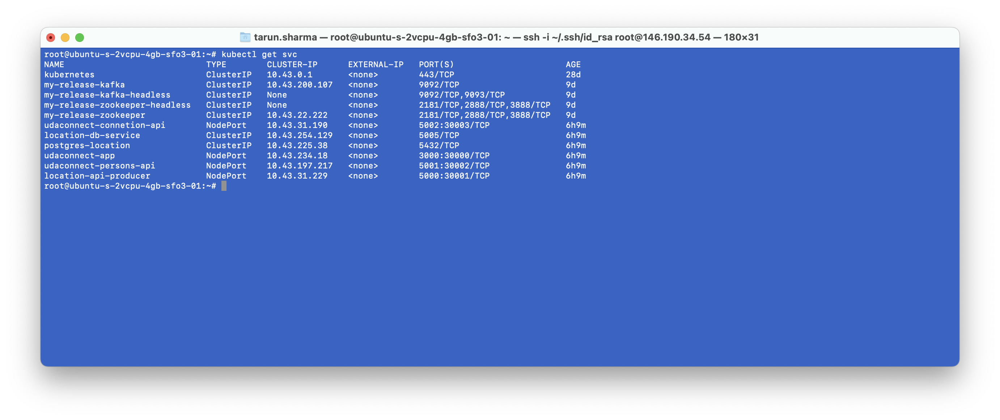

# UdaConnect
## Overview
### Background
Conferences and conventions are hotspots for making connections. Professionals in attendance often share the same interests and can make valuable business and personal connections with one another. At the same time, these events draw a large crowd and it's often hard to make these connections in the midst of all of these events' excitement and energy. To help attendees make connections, we are building the infrastructure for a service that can inform attendees if they have attended the same booths and presentations at an event.

### Design Approach

I have refacatored the monolithic udaconnect app by breaking it down into different services, each has it's unique purpose. The services are below:

- **location-api-producer:** This is rest api which will accept the location data from exteral source such as mobile device. Once data is recieved, it push the location data to **Kafka queue** and it's job is over. This way location producer will be able to handle large amount of data as this is light weight service which is just active as data reciever and not performing any operation on it.  
- **location-api-consumer**: Another service which is ready to listen any incoming data on **Kafka queue**, once data is pushed to queue, this service will fetch the data and call another service i.e. **location-db-app** over `grpc` protocol.
- **location-db-app**: This service is **grpc** server which will recieve the location data from **location-api-consumer** and store it in **location database**. As this is internal interfacing service I choose it to be `grpc` which will make it more efficient and faster.Also any kind of non-suuported location data will be ignored (should be logged as error) here as `grpc` is strongly typed api service.
- **udaconnect-persons-api**: This is very simple **rest api**, that will intereact with **person database** and expose endpoint to store and fetch person data.
- **udaconnect-connetion-api**: This is again **rest api** that expose a single endpoint to fetch connection data. This api will fetch data from both **location database** and **person database**

### Technologies
* [Flask](https://flask.palletsprojects.com/en/1.1.x/) - API webserver
* [SQLAlchemy](https://www.sqlalchemy.org/) - Database ORM
* [PostgreSQL](https://www.postgresql.org/) - Relational database
* [Kafka](https://kafka.apache.org/) - Message broker to ingest location data
* [gRPC](https://grpc.io/) - gRPC for efficient inter-service communication.
* [PostGIS](https://postgis.net/) - Spatial plug-in for PostgreSQL enabling geographic queries]
* [Vagrant](https://www.vagrantup.com/) - Tool for managing virtual deployed environments
* [VirtualBox](https://www.virtualbox.org/) - Hypervisor allowing you to run multiple operating systems
* [K3s](https://k3s.io/) - Lightweight distribution of K8s to easily develop against a local cluster

### Prerequisites
We will be installing the tools that we'll need to use for getting our environment set up properly.
1. [Install Docker](https://docs.docker.com/get-docker/)
2. [Set up a DockerHub account](https://hub.docker.com/)
3. [Set up `kubectl`](https://rancher.com/docs/rancher/v2.x/en/cluster-admin/cluster-access/kubectl/)
4. [Install VirtualBox](https://www.virtualbox.org/wiki/Downloads) with at least version 6.0
5. [Install Vagrant](https://www.vagrantup.com/docs/installation) with at least version 2.0

### Environment Setup
To run the application, you will need a K8s cluster running locally and to interface with it via `kubectl`. We will be using Vagrant with VirtualBox to run K3s.

### Running the app
Once the environment is up and running, we need to follow below steps to run the app
-  **Install Kafka**: We can use `https://bitnami.com/stack/kafka/helm` link to install the kafka infrastructure on k3s cluster. Once installed successfully you should get `kafka broker` & `zookeeper` app as shown in screenshot below:

- **Deploy App**: The easiest approach to deploy complete application is, go to root of project and run the command `kubectl apply -f ./deployments/`. This will deploy all microservice, frontend, postgres database, configmaps and secrets.
- **DB Setup**: The first time you run this project, you will need to seed the database with dummy data. Use the command `sh scripts/run_db_command.sh <POD_NAME>` against the `postgres` pod. (`kubectl get pods` will give you the `POD_NAME`). Subsequent runs of `kubectl apply` for making changes to deployments or services shouldn't require you to seed the database again!    

### Verifying it Works
Once the project is up and running, you should be able to see deployments and services in Kubernetes:
`kubectl get pods` and `kubectl get services` - should both return all exposed nodeport services and pods.

These pages should also load on your web browser with details of api methods:
* `http://localhost:30000/` - Frontend ReactJS Application
* `http://localhost:30001/` - OpenAPI documentation for location api
* `http://localhost:30002/` - OpenAPI documentation for person api
* `http://localhost:30003/` - OpenAPI documentation for connection api

## Future Enhancements
Some of future enhancements we can make to this applications are listed below.
* Refactor `udaconnect-connetion-api` to fetch the data from `udaconnect-person-api` & `udaconnect-location-api` instead of directly dealing with database.
* Simplify/Abstract the logic to filter the connection data in `udaconnect-connetion-api`.
* Exception Handling & Logging.
* Tracing.